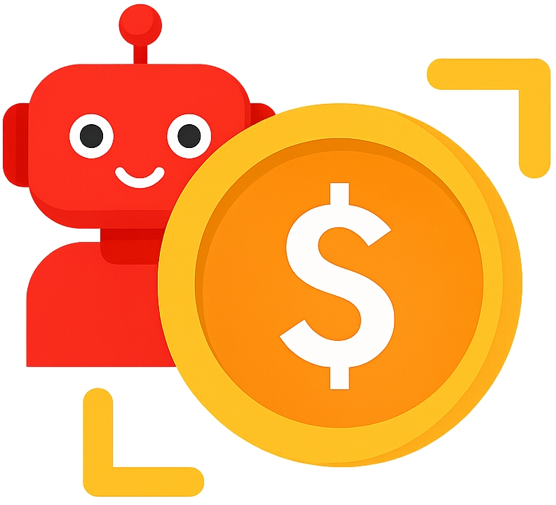
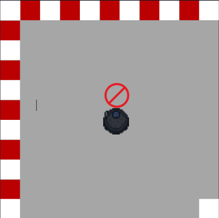

<p align="center">
  
</p>

<h1 align="center">CoinBot Rush
</h1>

<h3 align="center"> Desenvolvimento de Jogo para Controle de Robôs Autônomos em Realidade Aumentada com FPGA e ROS 2 Usando Linguagem C
</h3>

<div align="justify"> 
<h2>Descrição do Projeto</h2>

**CoinBot Rush** é um jogo de corrida em realidade aumentada, onde robôs autônomos e teleoperados coletam moedas virtuais e desviam de obstáculos no mundo real e no virtual.  Inspirado em **Mario Kart Live: Home Circuit**, o jogo foi desenvolvido como plataforma de validação do **Telecore 64**, um console portátil baseado em FPGA que combina videogames 2D e controle de robôs físicos.

O projeto integra sistemas embarcados, teleoperação e robótica, permitindo que jogadores comandem robôs equipados com sensores e atuadores, tanto de forma autônoma quanto manual, por meio do console. Durante o jogo, o Telecore 64 gerencia gráficos, lógica de jogo e comunicação em tempo real com o robô físico, utilizando uma arquitetura que combina FPGA, comunicação serial (UART) e protocolos de rede (TCP/IP) com ROS 2.

Essa integração cria uma experiência inovadora que une o mundo dos jogos, da robótica e da teleoperação em um único sistema imersivo e educativo.

</div>

<h2> Autor <br></h2>
<uL>
  <li><a href="https://github.com/TAlmeida003">Thiago Neri dos Santos Almeida</a></li>
  <li>Engenharia de Computação — UEFS</li>
</ul>


<h2> Orientador <br></h2>
<ul>
      <li>Dr. Anfranserai Morais Dias</li>
      <li>Departamento de Tecnologia (DTEC) — UEFS</li>
</ul>

<div align="justify">
<div id="tecnologias_utilizadas">
<h2>Tecnologias Utilizadas</h2>

</div>
</div>


<div align="justify"> 
<div id="design_do_jogo">

<h2>Design do Jogo (Expectativa)</h2>

<b>CoinBot Rush</b> é um jogo de corrida em realidade aumentada que combina desafios do mundo físico e virtual. O jogador controla um robô real, equipado com sensores, que percorre um circuito montado no ambiente físico. O objetivo é coletar moedas virtuais, exibidas na tela do console <b>Telecore 64</b>, enquanto desvia de obstáculos presentes tanto no espaço físico quanto no ambiente digital.

Durante a partida, a interface do console exibe o mapa do circuito, indicando a posição do robô, das moedas e dos obstáculos virtuais. O jogador pode escolher entre dois modos de controle: <b>teleoperação</b>, assumindo manualmente o comando do robô, ou <b>modo autônomo</b>, no qual o robô navega sozinho, utilizando seus sensores e algoritmos de navegação.

O desafio está em navegar com precisão, traçar rotas eficientes, evitar colisões e otimizar o tempo para coletar o maior número possível de moedas. A proposta oferece uma experiência que une a dinâmica de videogames com o controle físico de robôs, proporcionando uma interação única entre os mundos real e virtual.

<h3>Sprites e Interface</h3>
sprites do turtlebot 4 nas 12 direções, sprites de moedas, obstáculos e elementos de interface foram criados para compor a experiência visual do jogo. A interface do console exibe o mapa do circuito, a pontuação atual e o tempo restante para completar a corrida.

Sprite do robô:

<p align="center">
  

Inspirado em jogos clássicos de corrida, o circuito possui um trajeto pré-definido, com obstáculos estrategicamente posicionados e moedas distribuídas como itens de coleta. O mapa do jogo é maior que a área visível na tela do console; conforme o robô se desloca, a câmera acompanha seu movimento, permitindo que o jogador explore o espaço, visualize o ambiente e planeje suas rotas de forma estratégica.

<p align="center">
  
</p>
<p align="center"><strong>Figura XX: Mapa completo do jogo</strong></p>

<p align="center">
  
</p>
<p align="center"><strong>Figura XX: Área visível no console durante o jogo</strong></p>

Em caso de colisão no ambiente físico, o robô interrompe imediatamente seus movimentos, evitando danos. Simultaneamente, o jogo exibe um <i>sprite</i> de alerta na interface, indicando o bloqueio e a impossibilidade de seguir na direção impactada.

<p align="center">
  
</p>
<p align="center"><strong>Figura XX: Sprite de alerta de colisão</strong></p>


<h4> Tamanho do Mapa </h4>

Fator de escala do jogo é de aproximadamente **1:91**, onde 1 metro equivale a 91 pixels, ou seja, 1 pixel equivale a aproximadamente **0.011 metros** (11 mm). 
Essa escala é utilizada para mapear o ambiente físico no espaço virtual do jogo, permitindo que o robô se mova de forma proporcional ao tamanho real do circuito.

|Elemento| Tamanho (pixels)| Tamanho (metros)|
|--------|------------------|------------------|
|Robô    | 40 x 40 | 0,44 x 0,44 |
| Bloco | 8 x 8 | 0,088 x 0,088 |
|Zona Visível  | 400 x 400 | 4,4 x 4,4 |
| Pista Completa | 1392 x 1392 | 15,312 x 15,312  |


Como é usado os blocos o fator de escala do jogo é de aproximadamente **1:11**, onde 1 bloco equivale a 0.088 metros, ou seja, 1 metro equivale a aproximadamente **11 blocos** ou precisamente **11,36 blocos**.

<h4>Velocidade e Tempos</h4>

<p>No jogo, o deslocamento ocorre em unidades fixas de um bloco, que equivale a <strong>0,088 metros</strong>. A tabela abaixo apresenta os tempos de movimentação do robô em diferentes cenários, considerando a velocidade máxima de <strong>0,46 m/s</strong> e a mínima de <strong>0,10 m/s</strong>. Esses tempos são calculados com base na distância percorrida por bloco e na velocidade configurada pelo jogador.</p>

<table>
  <thead>
    <tr>
      <th>Movimento</th>
      <th>Tempo (ms)</th>
      <th>Velocidade (m/s)</th>
      <th>Frequência (Hz)</th>
    </tr>
  </thead>
  <tbody>
    <tr>
      <td>Melhor cenário</td>
      <td>191</td>
      <td>0,46</td>
      <td>5,2</td>
    </tr>
    <tr>
      <td>Cenário médio</td>
      <td>244</td>
      <td>0,36</td>
      <td>4,1</td>
    </tr>
    <tr>
      <td>Cenário médio</td>
      <td>339</td>
      <td>0,26</td>
      <td>2,9</td>
    <tr>
      <td>Pior cenário</td>
      <td>550</td>
      <td>0,16</td>
      <td>1,8</td>
    </tr>
  </tbody>
</table>

<p>Com base nesses tempos, é possível estimar a frequência de atualização do robô, que varia aproximadamente entre <strong>1 Hz e 5 Hz</strong>, dependendo da velocidade selecionada. Isso significa que o robô atualiza sua posição a cada <strong>200 ms a 600 ms</strong>, o que já proporciona uma resposta satisfatória aos comandos do console.</p>

<p>Considerando a velocidade máxima de <strong>0,46 m/s</strong>, o robô percorre cerca de <strong>0,046 metros</strong> (4,6 cm) a cada <strong>100 ms</strong>. Como isso representa aproximadamente metade de um bloco do jogo, uma taxa de amostragem de até <strong>10 Hz</strong> (atualizações a cada 100 ms) seria suficiente para garantir um controle suave e responsivo.</p>

<p>Assim, a taxa de quadros por segundo (FPS) do jogo é definida como <strong>10 FPS</strong>, o que permite uma atualização visual adequada tanto do ambiente quanto da movimentação do robô.</p>

| Velocidade (m/s) | Tempo por bloco (ms) | distância percorrida em 100 ms (mm)| número de comandos por bloco | Tempo perdido por comando (ms) |
|------------------|-----------------|-------------------------------|------------------------------| ----------------------------|
|        0,46      |      191      |   46                        |  2                           | 9  |
|        0.36      |      244      |   36                        |  3                           | 56 |
|        0.26      |      339      |   26                        |  4                           | 61 |
|        0.16      |      550      |   16                        |  6                           | 5  |

<p>Mesmo com frequências mais baixas (entre 1 Hz e 5 Hz), o sistema continua funcionando de forma adequada, evitando movimentos bruscos e mantendo o realismo da simulação.</p>


</div>
</div>


<div align="justify">
<div id="arquitetura_do_sistema">
<h2>Arquitetura do Sistema</h2>


<h3>Comunicação</h3>

<h4>Comandos</h4>

<p align="center">
  
</p>
<p align="center"><strong>Figura XX: Layout e funções do joystick para controle do robô</strong></p>

`Conectar`Iniciar a conexão com o robô, estabelecendo a comunicação entre o console e o robô. O robô passa a enviar dados de sua posição e estado, enquanto o console envia comandos de controle.

`Desconectar`Finalizar a conexão com o robô, interrompendo a comunicação e desativando o controle remoto.

> Se passar mais de 1 minuto sem receber dados do console, o robô assume que a conexão foi perdida e para de se mover.

`Reset` Reiniciar o robô, limpando seu estado atual e reiniciando a lógica de jogo. O robô retorna à sua posição inicial de maneira manual, e espera novos comandos do console.

`Velocidade` Ajustar a velocidade do robô, permitindo que o jogador controle a aceleração linear. A velocidade é definida em metros por segundo (m/s) e pode ser ajustada entre 0.1 m/s a 0.3 m/s. Ao fazer isso, os tempos de resposta do robô são ajustados para garantir a escalação adequada do movimento.

`Direção` A direção do robô definindo os vetores de aceleração linear e angular.

`Adicionar ponto` Adicionar 10 pontos durante o mapa para execução automática posteriormente. Esses pontos são utilizados para traçar rotas e otimizar o percurso do robô.

`Remover ponto` Remover o último ponto adicionado, permitindo ao jogador ajustar a rota do robô conforme necessário.

`Modo autônomo/teleoperado` Alternar entre os modos de controle do robô. No modo autônomo, o robô navega sozinho nos pontos previamente definidos, enquanto no modo teleoperado, o jogador assume o controle manual.

<h4>Protocolos</h4>

Do cliente para o servidor, `t` é o tipo de comando a ser enviado, podendo ser, um reset (0), ou um movimento do robô (1). o campo `a` é a aceleração angular do robô, e `l` é a aceleração linear. 

``` json
{
  "t": 1,
  "a": 0.5,
  "l": 0.5,
}
```

Do servidor para o cliente, `x` e `y` são as coordenadas do robô no mapa, `a` é o angular do robô, e `cw` é o aviso de colisão, que pode ser 0 (sem colisão), 1 (perto de colisão) ou 2 (colisão).

``` json
{
  "x": 1.0,
  "y": 2.0,
  "a": 0.5,
  "cw": 1
}
```


</div>
</div>

<div align="justify">
<div id="plano_de_desenvolvimento">
<h2>Plano de Desenvolvimento</h2>

<h3>Funcionalidades Implementadas</h3>

<h3>Funcionalidades Pendentes</h3>

</div>
</div>


<div align="justify"> 
<div id="referencias"> 


<h2>Referências</h2>

> NINTENDO. Mario Kart Live: Home Circuit. Disponível em: https://www.mariowiki.com/Mario_Kart_Live:_Home_Circuit. Acesso em: 30 maio 2025.

>

</div>
</div>